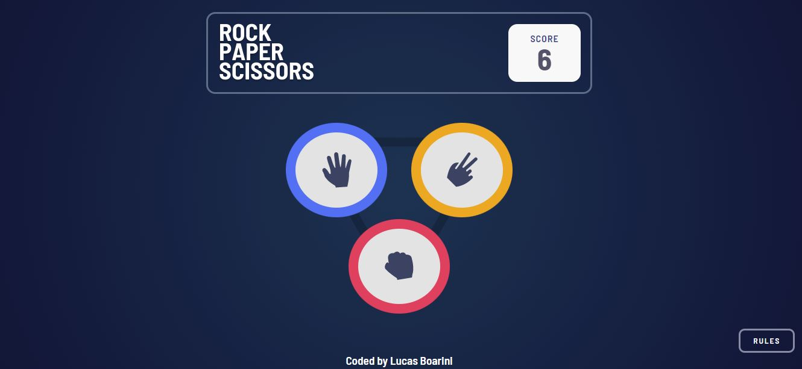

# Rock Paper Scissors Game

Decidi realizar um jogo nesse projeto, o jogo é o pedra papel tesoura, um jogo bem conhecido que muitos já jogaram, em meu projeto o usuário irá jogar contra o computador. Acredito que esse projeto irá me ajudar a melhorar minhas habilidades com o design e também o JavaScript.

## Menu

- [Meu Processo](#meu-peocesso)
- [Screenshot](#screenshot)
- [Link](#link)
- [Construido com](#construido-com)
- [Contatos](#contatos)

### Meu Processo

Com o desenvolvimento desse projeto consegui aprender mais sobre como manipular dados com o JavaScript, e aprimorar também minhas habilidades com o Flexbox no CSS. Eesse projeto realizando as seguintes etapas:

- [ ] Montar estrutura básica do jogo;
- [ ] Criar página das regras;
- [ ] Criar funções para computador escolher jogada;
- [ ] Desenvolver tela de fim do jogo;

### Screenshot

<!--Abaixo estou deixando um screenshot do design final do projeto conforme desenvolvi: **-->

<!---->

### Link

<!--Estou deixando abaixo o link com o deploy do projeto para visualização direto no navegador:-->

<!--    - Para acessar o App clique [aqui](https://calculator-app-main-lake.vercel.app/)-->

### Construido com

As tecnologias utilizadas para esse projeto são as listadas abaixo:

- Semantic HTML5 markup
- CSS custom properties
- JavaScript

### Contatos

[LinkedIn](https://www.linkedin.com/in/lucas-boarini)